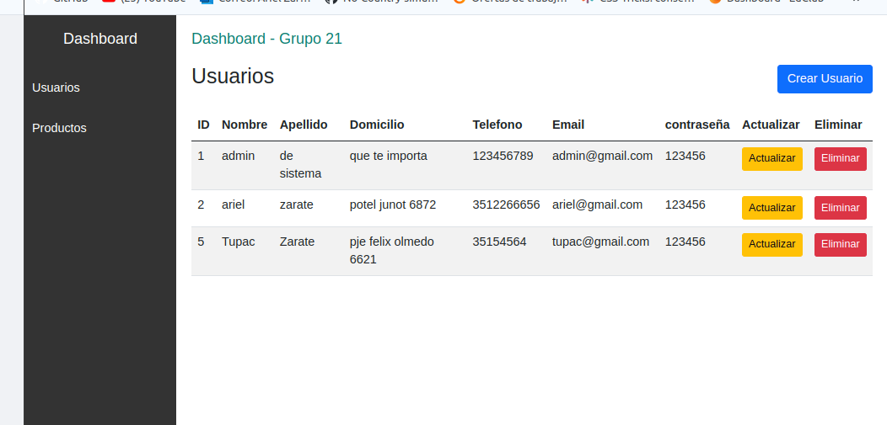
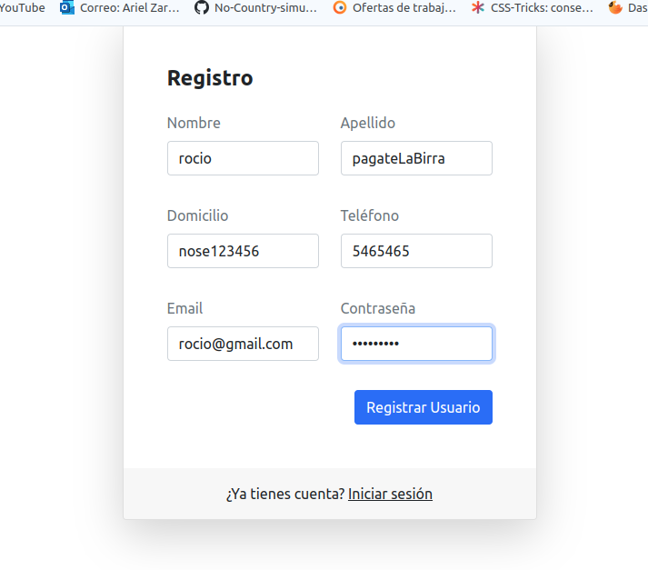
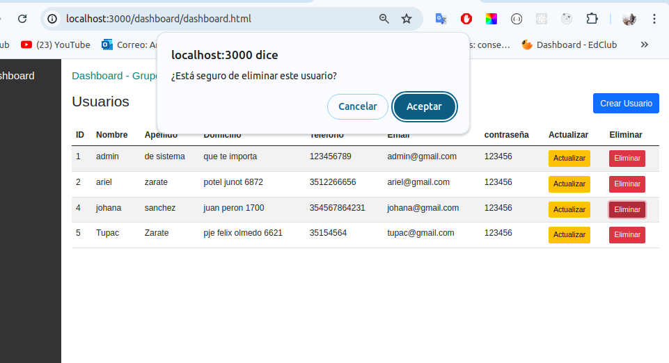
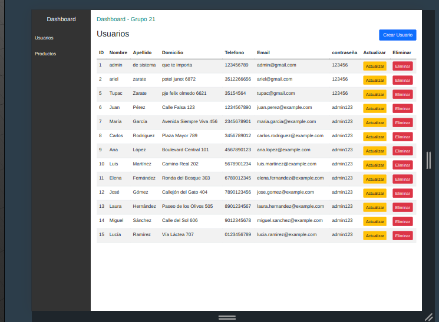

# Repositorio Grupo 21

## Node JS - Codo a Codo


### fuentes de formularios

` https://misterdigital.es/los-mejores-formularios-de-acceso-gratuitos-de-bootstrap/`

# Bootstrap 5 Login Page

This is a Bootstrap 5 Login Page template, you can use it as you wish and it's free for personal or commercial use.

<div align="center">

<
</div>

# Installation

Let's make it easy! Just download this template, use it on your project.

# Demo

- [Login](https://nauvalazhar.github.io/bootstrap-5-login-page/index.html)
- [Register](https://nauvalazhar.github.io/bootstrap-5-login-page/register.html)
- [Forgot Password](https://nauvalazhar.github.io/bootstrap-5-login-page/forgot.html)
- [Reset Password](https://nauvalazhar.github.io/bootstrap-5-login-page/reset.html)

## validacion de formularios con bootstrap

Correcto, no necesitas una clase validadora adicional porque Bootstrap 5 proporciona una manera sencilla de validar formularios utilizando sus clases y atributos HTML. Aquí tienes un resumen de cómo funciona todo junto con tu código ajustado:

```javascript
<!DOCTYPE html>
<html lang="en">
  <head>
    <meta charset="utf-8" />

    <meta name="viewport" content="width=device-width,initial-scale=1" />
    <meta
      name="description"
      content="This is a login page template based on Bootstrap 5"
    />
    <title>Login Page</title>
    <link
      href="https://cdn.jsdelivr.net/npm/bootstrap@5.0.0-beta2/dist/css/bootstrap.min.css"
      rel="stylesheet"
      integrity="sha384-BmbxuPwQa2lc/FVzBcNJ7UAyJxM6wuqIj61tLrc4wSX0szH/Ev+nYRRuWlolflfl"
      crossorigin="anonymous"
    />
  </head>

  <body>
    <section class="h-100 my-3 py-5">
      <div class="container h-100">
        <div class="row justify-content-sm-center h-100">
          <div class="col-xxl-4 col-xl-5 col-lg-5 col-md-7 col-sm-9">
            <div class="text-center my-5">
            <!--

              
            </div>

            -->
            <div class="card shadow-lg">
              <div class="card-body p-5">
                <h1 class="fs-4 card-title fw-bold mb-4">Iniciar Sesion</h1>
                <form
                  id="loginForm"
                  class="needs-validation"
                  novalidate
                  autocomplete="off"
                  method="post"
                >
                  <div class="mb-3">
                    <label class="mb-2 text-muted text-start w-100" for="email">Correo</label>
                    <input
                      id="email"
                      type="email"
                      class="form-control"
                      name="email"
                      value=""
                      placeholder="example@gmail.com"
                      required
                      autofocus
                    />
                  <div class="invalid-feedback">
                  Por favor, ingrese un email válido.
                  </div>
                  </div>
                  <div class="mb-3">
                    <label class="mb-2 text-muted text-start w-100" for="contrasena"
                      >Contraseña</label
                    >
                    <input
                      id="contrasena"
                      type="password"
                      placeholder="*********"
                      class="form-control"
                      name="contrasena"
                      value=""
                      required
                      autofocus
                    />
                 <div class="invalid-feedback">
                 Por favor, ingrese una contraseña válida.

                 </div>
                  </div>

                  <div class="d-flex align-items-center">
                    <button type="submit" class="btn btn-primary ms-auto">
                      Iniciar Sesion
                    </button>
                  </div>
                </form>
              </div>
              <!--
              <div class="card-footer py-3 border-0">
                <div class="text-center">
                  Remember your password?
                  <a href="index.html" class="text-dark">Login</a>
                </div>
              </div>
            </div>
            <div class="text-center mt-5 text-muted">
              Copyright &copy; 2017-2021 &mdash; Your Company
            </div>


              -->
          </div>
        </div>
      </div>
    </section>

    <script src="./login.js"></script>
  </body>
</html>

```

#### JavaScript (login.js)

```javascript
const loginForm = document.getElementById("loginForm");

const iniciarSesion = (event) => {
  event.preventDefault();

  const email = document.getElementById("email").value;
  const contrasena = document.getElementById("contrasena").value;

  if (loginForm.checkValidity()) {
    // Validación adicional del correo electrónico
    if (!validarEmail(email)) {
      document.getElementById("email").classList.add("is-invalid");
      document.getElementById("email").classList.remove("is-valid");
    } else {
      document.getElementById("email").classList.add("is-valid");
      document.getElementById("email").classList.remove("is-invalid");
    }

    // Aquí puedes agregar el código para enviar los datos al servidor
    console.log(email, contrasena);
  }

  //=========explicacion de codigo================
  // Añade la clase "was-validated" a la form para que se muestren los errores de validación
  // esto trabaja junto a las clases de html
  //    class="needs-validation"
  //<div class="invalid-feedback">Por favor, ingrese una contraseña válida.</div>

  loginForm.classList.add("was-validated");
};

//=========validar email=====================
const validarEmail = (email) => {
  const re = /^[^\s@]+@[^\s@]+\.[^\s@]+$/;
  return re.test(String(email).toLowerCase());
};

//======================agregar funcion al evento==========================================
loginForm.addEventListener("submit", iniciarSesion);
```

Explicación
HTML:

- La clase needs-validation en el formulario se utiliza para activar la  
  validación personalizada de Bootstrap.
  novalidate desactiva la validación del navegador por defecto para usar la de Bootstrap.
  required en los campos asegura que deben ser llenados.
  invalid-feedback proporciona mensajes de error para los campos no válidos.
  JavaScript:

- loginForm.checkValidity() verifica si el formulario es válido según
  las reglas de Bootstrap.
  event.preventDefault() previene el comportamiento por defecto del formulario (recargar la página).
  event.stopPropagation() detiene la propagación del evento de envío.
  loginForm.classList.add('was-validated') aplica estilos de validación a los campos después de intentar enviar el formulario.

  ### evento document.addEventListener("DOMContentLoaded", () => { ... })

- La razón por la que se usa document.addEventListener("DOMContentLoaded", () => { ... }) es asegurar que el código JavaScript se ejecute solo después de que todo el contenido HTML haya sido completamente cargado y procesado por el navegador. Esto es importante porque si tratas de acceder a elementos del DOM antes de que estén completamente cargados, tu código puede fallar porque esos elementos no existen todavía en el momento en que el script se ejecuta.

- En mi caso no lo envolvi porque tego el scrip al final del html antes de cerrar el body 😀

### Validacion sin Boostrap con javascript

```javascript
//opcion 2 de validacion  atrves de js sin usar clases de boostrap

let login = document.getElementById("loginForm");

const iniciarSesion = async (event) => {
  event.preventDefault();

  const email = document.getElementById("email").value;
  const contrasena = document.getElementById("contrasena").value;

  // Validar los datos de login
  let isValid = validarLogin(email, contrasena);

  if (isValid) {
    try {
      //aca realizo el fect y envio los datos
      console.log(email, contrasena);
    } catch (error) {
      console.log(error.message);
      alert(error.message);
    }
  }

  login.reset(); //Limpia los campos del formulario al enviar
};

//=========validar login=====================
function validarLogin(email, contrasena) {
  if (email.trim() === "" || contrasena.trim() === "") {
    alert("Por favor, ingrese todos los campos.");
    return false;
  }

  //llama a una funcion de afuera el email
  if (!validarEmail(email)) {
    alert("Por favor, ingrese un email válido.");
    return false;
  }
  //llama a una funcion de afuera contraseña
  if (!validarContrasena(contrasena)) {
    alert(
      "Por favor, ingrese una contraseña válida. Debe tener al menos 8 caracteres, incluir letras mayúsculas y minúsculas, números y caracteres especiales."
    );
    return false;
  }

  return true;
}

function validarEmail(email) {
  const re = /^[^\s@]+@[^\s@]+\.[^\s@]+$/;
  return re.test(String(email).toLowerCase());
}

function validarContrasena(contrasena) {
  const re =
    /^(?=.*[a-z])(?=.*[A-Z])(?=.*\d)(?=.*[@$!%*?&])[A-Za-z\d@$!%*?&]{8,}$/;
  return re.test(String(contrasena));
}

//======================agregar funcion al evento==========================================
login.addEventListener("submit", iniciarSesion);
```

- Notar que hay mas codigo ya que javascript debe validar campo a campo
- ademas notar que envia un alert con un mensaje , no es lo mas optimo
- podria usarse javascript para mostrar un <span> con un error abajo .
- muchas opciones para el mismo resultado

## express-session

- Para la authenticationuse `npm install express express-session`

En el server de express

```javascript
const express = require("express");
const session = require("express-session");
const app = express();

// Configuración básica de express-session
app.use(
  session({
    secret: "clave-secreta", // Clave secreta para firmar la sesión
    resave: false,
    saveUninitialized: true,
  })
);
```

```javascript
const db = require("../db/db");

const iniciarSesion = async (req, res) => {
  const { email, contrasena } = req.body;

  // Verificar que se reciban email y contraseña
  if (!email || !contrasena) {
    return res
      .status(400)
      .json({ error: "Por favor, ingrese email y contraseña." });
  }

  try {
    // Consultar el usuario en la base de datos
    const sql = "SELECT * FROM usuarios WHERE email = ? AND contrasena = ?";
    db.query(sql, [email, contrasena], (err, result) => {
      if (err) {
        console.error("Error al buscar usuario en la base de datos:", err);
        return res.status(500).json({
          message: "Error al buscar usuario en la base de datos.",
          error: err.message,
        });
      }

      // Verificar si se encontró un usuario con ese email y contraseña
      if (result.length === 1) {
        // Usuario autenticado correctamente
        // Guardar datos del usuario en la sesión
        req.session.usuario = result[0]; // Guardar el primer resultado encontrado
        return res.json({
          message: "Inicio de sesión exitoso",
          status: 200,
        });
      } else {
        // Usuario no encontrado o credenciales incorrectas
        throw new Error({
          error: "Credenciales de inicio de sesión incorrectas",
          status: 401,
        });
      }
    });
  } catch (error) {
    console.error("Error iniciando sesión:", error);
    return res.status(500).json({
      message: "Error al iniciar sesión",
      error: error.message,
    });
  }
};

module.exports = {
  iniciarSesion,
};
```

Explicación

- Configuración de express-session: Se realiza una única vez en la configuración de tu aplicación Express.

- Uso de req.session: Después de autenticar al usuario en la base de datos, puedes guardar los datos relevantes del usuario (result[0] en este caso) en req.session.usuario.

- Almacenamiento de Datos de Sesión: req.session.usuario es un objeto donde puedes almacenar cualquier dato relacionado con el usuario que necesites persistir durante la sesión del usuario.

# screenshot





